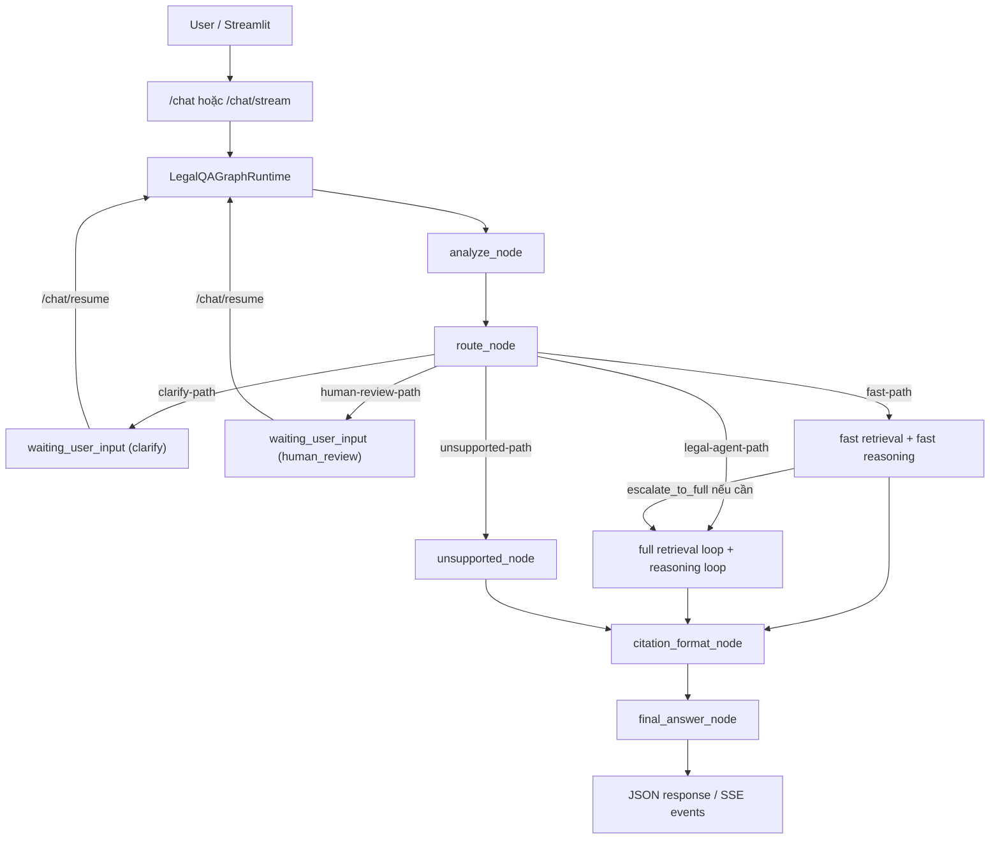

m# Hệ thống Hỏi đáp Văn bản Pháp luật đa tác tử dùng RAG và LangGraph

> README này mô tả đúng trạng thái code hiện tại của repo `Vietnamese Legal QA RAG`.
> Stack chính: `LangGraph + FastAPI + Streamlit + Qdrant + Ollama + Hybrid Retrieval`.

## 1. Tổng quan

Đây là hệ thống hỏi đáp pháp luật tiếng Việt theo kiến trúc agentic mức 3. Hệ thống không chỉ truy xuất tài liệu và sinh câu trả lời, mà còn có thể:

- phân loại intent câu hỏi,
- gán mức rủi ro pháp lý,
- route sang nhiều nhánh xử lý khác nhau,
- chạy retrieval loop và reasoning loop,
- dừng để `clarify` hoặc `human_review`,
- lưu checkpoint theo `thread_id` và `session_id`,
- resume cuộc hội thoại qua `/chat/resume`,
- stream trace backend ra UI bằng SSE.

## 2. Kiến trúc hiện tại

### 2.1 Các tầng chính

- `TV1 - Data ingest`: parse snapshot Bộ pháp điển điện tử và chuẩn hóa dữ liệu.
- `TV2 - Indexing`: build article-level index vào Qdrant.
- `TV3 - Retrieval`: rewrite query, retrieve, rerank, retrieval check, fallback policy.
- `TV4 - Router`: intent classifier, clarify detector, risk tagger, route node.
- `TV5 - Reasoning`: generate draft, grounding check, revise answer, citation critic.
- `TV6 - Orchestration`: LangGraph runtime, checkpointing, interrupt/resume, FastAPI routes.
- `UI`: Streamlit chat frontend.

### 2.2 Luồng tổng quát



### 2.3 Các route hiện có

- `clarify-path`: câu hỏi thiếu dữ kiện pháp lý quan trọng để truy xuất chính xác.
- `human-review-path`: câu hỏi rủi ro cao hoặc cần người dùng xác nhận phạm vi trả lời.
- `unsupported-path`: câu hỏi ngoài miền pháp luật mà hệ thống hỗ trợ.
- `fast-path`: đường xử lý nhẹ cho câu hỏi định nghĩa, tra cứu điều luật, low-risk.
- `legal-agent-path`: pipeline đầy đủ cho câu hỏi pháp lý bình thường hoặc phức tạp.

### 2.4 Fast-path và legal-agent-path khác nhau ra sao

| Tiêu chí | Fast-path | Legal-agent-path |
|---|---|---|
| Mục tiêu | Trả lời nhanh | Trả lời chắc chắn hơn |
| Query rewrite | Ít query hơn | Nhiều query hơn |
| Retrieval | Top-k nhỏ, article-first | Recall cao hơn |
| Rerank | Có thể bỏ CrossEncoder | Đầy đủ hơn |
| Grounding | 1 vòng | Có revise / retrieve_again / human_review |
| Sources | 1-2 nguồn mạnh nhất | Có thể nhiều nguồn hơn |

## 3. Bộ dữ liệu đang dùng

### 3.1 Nguồn dữ liệu gốc

Nguồn dữ liệu gốc hiện tại là **Bộ pháp điển điện tử** của Bộ Tư pháp:

- [https://phapdien.moj.gov.vn/TraCuuPhapDien/MainBoPD.aspx](https://phapdien.moj.gov.vn/TraCuuPhapDien/MainBoPD.aspx)

Trang này là cổng tra cứu chính thức của Bộ pháp điển. Trong thực tế của repo hiện tại, dữ liệu không được gọi trực tiếp online lúc chạy chatbot, mà được **tải snapshot offline**, parse thành corpus cục bộ, rồi index vào Qdrant.

### 3.2 Tải về và lưu ở đâu

Luồng dữ liệu hiện tại là:

1. Mở cổng Bộ pháp điển điện tử của Bộ Tư pháp.
2. Tải snapshot offline của Bộ pháp điển về máy.
3. Giải nén hoặc chép toàn bộ snapshot vào:
   - `D:\BTLNLP\chatbot-phap-luat-rag\data\raw\BoPhapDienDienTu`
4. Chạy TV1 để ingest và tạo dữ liệu chuẩn hóa ở `data/processed`.
5. Chạy TV2 để build index article-level vào Qdrant.

Lưu ý:

- Repo hiện tại **không có bước tự tải snapshot từ Internet trong runtime chatbot**.
- `src/tv1_data/sync_official_snapshot.py` là script đồng bộ **từ snapshot local** đang có, không phải downloader từ website.

### 3.3 Snapshot local hiện đang nằm ở đâu

Snapshot đang có trong working tree nằm tại:

- `D:\BTLNLP\chatbot-phap-luat-rag\data\raw\BoPhapDienDienTu`

Thư mục này hiện chứa:

- `BoPhapDien.html`: trang gốc offline.
- `jsonData.js`: cây dữ liệu đề mục dùng để parse.
- `demuc\*.html`: các file HTML theo từng đề mục pháp điển.
- `lib\`: CSS, JS, ảnh và tài nguyên tĩnh của snapshot.

Tại thời điểm README này được cập nhật, snapshot local đang có:

- `306` file HTML trong `demuc\`
- `57` file tài nguyên trong `lib\`

### 3.4 Sau khi parse, dữ liệu được lưu ở đâu

TV1 sinh ra các artifact chính sau:

- `D:\BTLNLP\chatbot-phap-luat-rag\data\manifests\legal_corpus_manifest.jsonl`
  - manifest theo từng file nguồn, dùng cho incremental sync.
- `D:\BTLNLP\chatbot-phap-luat-rag\data\processed\all_chunks.jsonl`
  - corpus chunk chính để retrieval/indexing.
- `D:\BTLNLP\chatbot-phap-luat-rag\data\processed\all_chunks.json`
  - bản JSON đầy đủ của toàn bộ chunks.
- `D:\BTLNLP\chatbot-phap-luat-rag\data\processed\chunks_preview.csv`
  - file preview để kiểm tra nhanh.
- `D:\BTLNLP\chatbot-phap-luat-rag\data\processed\stats.json`
  - thống kê corpus sau ingest.

### 3.5 Quy mô dữ liệu hiện tại

Theo `D:\BTLNLP\chatbot-phap-luat-rag\data\processed\stats.json`, corpus hiện tại có:

- `306` file nguồn đã parse,
- `440212` chunks,
- `537` chunk rỗng,
- độ dài nội dung trung bình khoảng `384.97` ký tự,
- độ dài chunk tối đa `800` ký tự.

Ngoài corpus đầy đủ, repo còn có một bộ smoke test nhỏ:

- `D:\BTLNLP\chatbot-phap-luat-rag\data\processed\tv1_smoke`

Bộ này hiện có:

- `1` đề mục nguồn,
- `564` chunks,
- dùng rất tiện để kiểm tra nhanh flow ingest hoặc retrieval.

### 3.6 Dữ liệu retrieval thực tế dùng kiểu gì

Hệ thống hiện dùng **article-level retrieval** là chính.

Mỗi article được build thành `retrieval_text` theo dạng:

```text
{title}. {law_id}. {article}. {article_code}. {article_name}. {de_muc}. {content}
```

Ví dụ:

```text
Luật Thanh niên. Luật số 57/2020/QH14. Điều 1. Điều 36.3.LQ.1. Thanh niên. Đề mục 36.3 - Thanh niên. Thanh niên là công dân Việt Nam từ đủ 16 tuổi đến 30 tuổi.
```

Điều này giúp các câu kiểu:

- `Điều 1 Luật Thanh niên quy định gì?`
- `Theo Luật Thanh niên, thanh niên là gì?`
- `Luật số 57/2020/QH14 nói gì về thanh niên?`

được match tốt hơn nhờ kết hợp cả nội dung và metadata pháp lý.

## 4. Script liên quan đến dữ liệu

### 4.1 TV1 ingest

- `D:\BTLNLP\chatbot-phap-luat-rag\src\tv1_data\ingest_bo_phap_dien.py`
  - parse snapshot local và export toàn bộ artifact TV1.
- `D:\BTLNLP\chatbot-phap-luat-rag\src\tv1_data\sync_official_snapshot.py`
  - đồng bộ incremental khi snapshot local thay đổi.
- `D:\BTLNLP\chatbot-phap-luat-rag\src\tv1_data\parse_clean.py`
  - parse và làm sạch HTML.
- `D:\BTLNLP\chatbot-phap-luat-rag\src\tv1_data\chunk_legal_docs.py`
  - chunk hóa văn bản pháp luật.

### 4.2 TV2 indexing

- `D:\BTLNLP\chatbot-phap-luat-rag\src\tv2_index\build_qdrant_index.py`
  - build index article-level vào Qdrant.
- `D:\BTLNLP\chatbot-phap-luat-rag\src\tv2_index\search_with_filters.py`
  - hybrid search + metadata filters + exact legal boost.
- `D:\BTLNLP\chatbot-phap-luat-rag\src\tv2_index\qdrant_manager.py`
  - create collection / upsert / alias swap.
- `D:\BTLNLP\chatbot-phap-luat-rag\src\tv2_index\embedding_registry.py`
  - registry embedding model.

## 5. Cấu trúc thư mục chi tiết

Lược đồ dưới đây tập trung vào các thư mục và file có ý nghĩa thực tế. Các thư mục tạm như `__pycache__`, `.pytest_cache`, `.tmp_pytest`, `.idea` được lược bớt.

```text
D:\BTLNLP\chatbot-phap-luat-rag
├─ README.md
├─ requirements.txt
├─ pytest.ini
├─ .checkpoints\
│  └─ ... local JSON checkpoint để resume hội thoại
├─ configs\
│  ├─ app.yaml
│  ├─ indexing.yaml
│  ├─ prompts.yaml
│  ├─ retrieval.yaml
│  └─ routing.yaml
├─ data\
│  ├─ chunks\
│  │  └─ ... thư mục dự phòng/legacy cho artifact chunk riêng
│  ├─ manifests\
│  │  ├─ legal_corpus_manifest.jsonl
│  │  └─ tv1_smoke_manifest.jsonl
│  ├─ processed\
│  │  ├─ all_chunks.json
│  │  ├─ all_chunks.jsonl
│  │  ├─ chunks_preview.csv
│  │  ├─ stats.json
│  │  └─ tv1_smoke\
│  │     ├─ all_chunks.json
│  │     ├─ all_chunks.jsonl
│  │     ├─ chunks_preview.csv
│  │     └─ stats.json
│  └─ raw\
│     └─ BoPhapDienDienTu\
│        ├─ BoPhapDien.html
│        ├─ jsonData.js
│        ├─ demuc\
│        │  └─ *.html
│        └─ lib\
│           └─ ... CSS/JS/ảnh của snapshot
├─ evaluation\
│  ├─ eval_qdrant_bge_m3.py
│  ├─ eval_ragas.py
│  └─ run_langsmith_eval.py
├─ notebooks\
│  ├─ 01_eda_legal_corpus.ipynb
│  ├─ 02_embedding_benchmark.ipynb
│  ├─ 03_prompt_debug.ipynb
│  └─ 04_error_analysis.ipynb
├─ src\
│  ├─ app\
│  │  ├─ api\
│  │  │  ├─ main.py
│  │  │  └─ routes\
│  │  │     ├─ chat.py
│  │  │     └─ stream.py
│  │  └─ ui\
│  │     └─ streamlit_app.py
│  ├─ graph\
│  │  ├─ builder.py
│  │  ├─ checkpointing.py
│  │  ├─ human_review_node.py
│  │  ├─ state.py
│  │  └─ subgraphs.py
│  ├─ tv1_data\
│  │  ├─ chunk_legal_docs.py
│  │  ├─ ingest_bo_phap_dien.py
│  │  ├─ parse_clean.py
│  │  └─ sync_official_snapshot.py
│  ├─ tv2_index\
│  │  ├─ build_qdrant_index.py
│  │  ├─ embedding_registry.py
│  │  ├─ qdrant_manager.py
│  │  ├─ search_with_filters.py
│  │  └─ swap_active_collection.py
│  ├─ tv3_retrieval\
│  │  ├─ fallback_policy.py
│  │  ├─ rerank_node.py
│  │  ├─ retrieval_check_node.py
│  │  ├─ retrieve_node.py
│  │  └─ rewrite_query_node.py
│  ├─ tv4_router\
│  │  ├─ clarify_detector.py
│  │  ├─ intent_classifier.py
│  │  ├─ risk_tagger.py
│  │  └─ route_node.py
│  └─ tv5_reasoning\
│     ├─ citation_critic.py
│     ├─ generate_draft_node.py
│     ├─ grounding_check_node.py
│     ├─ prompt_library.py
│     └─ revise_answer_node.py
└─ tests\
   ├─ test_graph_resume.py
   ├─ test_reasoning_policy.py
   ├─ test_retrieval_flow.py
   └─ test_router.py
```

## 6. Yêu cầu môi trường

### 6.1 Phần mềm cần có

- Python `3.10` hoặc `3.11`
- Ollama tại `http://localhost:11434`
- Qdrant tại `http://localhost:6333`

### 6.2 Gợi ý tạo môi trường Conda trên Windows

```powershell
conda create -n torch_py310 python=3.10 -y
conda activate torch_py310
```

## 7. Cài đặt

### 7.1 Cài dependency Python

```powershell
cd D:\BTLNLP\chatbot-phap-luat-rag
pip install -r requirements.txt
```

### 7.2 Chuẩn bị Ollama

Model mặc định đang dùng:

- router/reasoning: `qwen2.5:7b`
- embedding: `bge-m3`

Tải model:

```powershell
ollama pull qwen2.5:7b
ollama pull bge-m3
```

Chạy Ollama:

```powershell
ollama serve
```

### 7.3 Chuẩn bị Qdrant

Nếu chạy bằng Docker:

```powershell
docker run -p 6333:6333 qdrant/qdrant
```

## 8. Chạy pipeline dữ liệu

### 8.1 Build lại TV1 từ snapshot local

```powershell
cd D:\BTLNLP\chatbot-phap-luat-rag
python -m src.tv1_data.ingest_bo_phap_dien `
  --input data/raw/BoPhapDienDienTu `
  --manifest data/manifests/legal_corpus_manifest.jsonl `
  --output data/processed `
  --log-level INFO
```

### 8.2 Đồng bộ incremental khi snapshot local thay đổi

```powershell
cd D:\BTLNLP\chatbot-phap-luat-rag
python -m src.tv1_data.sync_official_snapshot `
  --input data/raw/BoPhapDienDienTu `
  --manifest data/manifests/legal_corpus_manifest.jsonl `
  --output data/processed `
  --log-level INFO
```

### 8.3 Build Qdrant index

```powershell
cd D:\BTLNLP\chatbot-phap-luat-rag
python -m src.tv2_index.build_qdrant_index `
  --input data/processed/all_chunks.jsonl `
  --level article `
  --config configs/indexing.yaml `
  --version-tag local `
  --activate-alias `
  --log-level INFO
```

Lưu ý:

- `configs/indexing.yaml` hiện dùng `text_field_for_embedding: retrieval_text`
- Qdrant timeout đang là `120` giây
- code đã có guard cắt payload quá lớn trước khi upsert

## 9. Chạy hệ thống

### 9.1 Chạy backend FastAPI

```powershell
cd D:\BTLNLP\chatbot-phap-luat-rag
python -m uvicorn src.app.api.main:app --host 127.0.0.1 --port 8000 --reload
```

Các URL hữu ích:

- Swagger: [http://127.0.0.1:8000/docs](http://127.0.0.1:8000/docs)
- Health: [http://127.0.0.1:8000/health](http://127.0.0.1:8000/health)

### 9.2 Chạy frontend Streamlit

Mở terminal khác:

```powershell
cd D:\BTLNLP\chatbot-phap-luat-rag
streamlit run src/app/ui/streamlit_app.py
```

UI hiện tại hỗ trợ:

- tin nhắn người dùng bên phải,
- tin nhắn assistant bên trái,
- streaming SSE,
- fallback từ `/chat/stream` sang `/chat`,
- render `resume_question` ngay trong khung chat,
- local conversation history từ `.checkpoints`.

### 9.3 Các endpoint chính

- `POST /chat`
- `POST /chat/stream`
- `POST /chat/resume`
- `GET /health`

## 10. Chạy test

Chạy toàn bộ test:

```powershell
cd D:\BTLNLP\chatbot-phap-luat-rag
python -m pytest tests -q
```

Chạy test theo nhóm:

```powershell
python -m pytest tests/test_router.py -q
python -m pytest tests/test_graph_resume.py -q
python -m pytest tests/test_retrieval_flow.py -q
python -m pytest tests/test_reasoning_policy.py -q
```

Tại thời điểm README này được cập nhật, suite local đang pass:

```text
33 passed
```

## 11. Chạy evaluation

Hệ thống hiện dùng 3 lớp evaluation chính:

- `evaluation/run_langsmith_eval.py`: đánh giá end-to-end hành vi router/API
- `evaluation/eval_qdrant_bge_m3.py`: đánh giá retrieval trên Qdrant
- `evaluation/eval_ragas.py`: đánh giá answer quality bằng thư viện `ragas`

Thư mục `evaluation/` hiện chỉ giữ lại 3 script trên để tránh chồng chéo vai trò:

- `run_langsmith_eval.py`: đo chất lượng điều phối end-to-end
- `eval_qdrant_bge_m3.py`: đo retrieval trên dataset pháp luật tiếng Việt
- `eval_ragas.py`: đo chất lượng câu trả lời cuối cùng

### 11.0 Bộ dữ liệu dùng cho evaluation

Ba lớp evaluation hiện tại dùng ba nguồn dữ liệu khác nhau:

- `vietnamese-legal-qa-routing-eval-v1` trên LangSmith:
  - dataset nội bộ để chấm `intent`, `route`, `risk`, `clarify`, `missing_slots`
  - dùng cho `evaluation/run_langsmith_eval.py`
- `YuITC/Vietnamese-Legal-Doc-Retrieval-Data` trên Hugging Face:
  - dùng để benchmark retrieval pháp luật tiếng Việt
  - script `evaluation/eval_qdrant_bge_m3.py` sẽ ưu tiên load dataset này nếu không truyền `--queries`
  - trong thực tế Hugging Face có thể redirect sang repo dataset thật `YuITC/Vietnamese-legal-documents`, và script đã hỗ trợ alias này
- `thangvip/vietnamese-legal-qa` trên Hugging Face:
  - dùng để benchmark chất lượng câu trả lời legal QA
  - script `evaluation/eval_ragas.py` sẽ ưu tiên load dataset này nếu không truyền `--input`
  - script sẽ lấy `question`, `reference_answer`, `article_content`, sau đó gọi local backend `/chat` để lấy answer của hệ thống rồi chấm bằng `ragas`

### 11.1 LangSmith end-to-end evaluation

Script này dùng dataset LangSmith `vietnamese-legal-qa-routing-eval-v1` và chấm các metric:

- `api_success`
- `intent_accuracy`
- `route_accuracy`
- `risk_accuracy`
- `clarify_accuracy`
- `missing_slot_accuracy`
- `retrieval_hint_present`

Terminal 1:

```powershell
cd D:\BTLNLP\chatbot-phap-luat-rag
python -m uvicorn src.app.api.main:app --host 127.0.0.1 --port 8000
```

Terminal 2:

```powershell
cd D:\BTLNLP\chatbot-phap-luat-rag
$env:LANGSMITH_TRACING="true"
$env:LANGSMITH_API_KEY="your_key_here"
$env:LANGSMITH_PROJECT="legal-rag-tv6"
$env:EVAL_LIMIT="5"
$env:EVAL_DEBUG="true"
python evaluation\run_langsmith_eval.py
```

Bỏ `EVAL_LIMIT` nếu muốn chạy toàn bộ dataset.

### 11.2 Retrieval evaluation trên dataset YuITC

Script `evaluation/eval_qdrant_bge_m3.py` sẽ ưu tiên load dataset Hugging Face `YuITC/Vietnamese-Legal-Doc-Retrieval-Data` nếu không truyền `--queries`.
Dataset public hiện tại trên Hugging Face có thể được redirect về repo thật `YuITC/Vietnamese-legal-documents`; script đã hỗ trợ alias này.

Điều kiện cần:

- Qdrant đang chạy
- article-level index đã build xong
- môi trường Python cài được `datasets`

Ví dụ chạy 50 mẫu:

```powershell
cd D:\BTLNLP\chatbot-phap-luat-rag
python evaluation\eval_qdrant_bge_m3.py `
  --level article `
  --top-k 5 10 `
  --limit 50 `
  --output evaluation\results
```

### 11.3 Answer quality evaluation bằng RAGAS

Script `evaluation/eval_ragas.py` sẽ ưu tiên load dataset Hugging Face `thangvip/vietnamese-legal-qa` nếu không truyền `--input`. Sau đó script gọi local backend `/chat` để lấy answer của chatbot, rồi chấm bằng `ragas`.

Điều kiện cần:

- backend FastAPI đang chạy
- Ollama đang chạy
- môi trường Python cài được `ragas`, `datasets`, `pyarrow`, `openai`

Nếu chạy trên Windows và gặp lỗi `DLL load failed` từ `datasets` hoặc `pyarrow`, hãy cài lại dependency từ `requirements.txt` trước khi chạy RAGAS eval.

Terminal 1:

```powershell
cd D:\BTLNLP\chatbot-phap-luat-rag
python -m uvicorn src.app.api.main:app --host 127.0.0.1 --port 8000
```

Terminal 2:

```powershell
cd D:\BTLNLP\chatbot-phap-luat-rag
$env:RAGAS_BASE_URL="http://127.0.0.1:11434"
$env:RAGAS_LLM_MODEL="qwen2.5:7b"
$env:RAGAS_EMBED_MODEL="bge-m3"
python evaluation\eval_ragas.py `
  --limit 20 `
  --mode llm `
  --api-url http://127.0.0.1:8000/chat `
  --output-dir evaluation\results
```

Nếu chỉ muốn chạy metric không cần LLM judge:

```powershell
python evaluation\eval_ragas.py `
  --limit 20 `
  --mode non_llm `
  --api-url http://127.0.0.1:8000/chat `
  --output-dir evaluation\results
```

### 11.4 File kết quả evaluation

Các script evaluation sẽ ghi kết quả vào:

- `evaluation/results/eval_qdrant_bge_m3_summary.json`
- `evaluation/results/eval_qdrant_bge_m3_summary.csv`
- `evaluation/results/eval_ragas_summary.json`
- `evaluation/results/eval_ragas_summary.csv`
- `evaluation/results/eval_ragas_details.jsonl`

## 12. Kịch bản chạy thử nên dùng

### 12.1 Direct legal lookup

```text
Điều 1 Luật Thanh niên quy định gì?
Theo Luật Thanh niên, thanh niên là gì?
```

Kỳ vọng:

- route vào `fast-path` hoặc `fast-path -> legal-agent-path`
- không `human_review` oan
- trả lời trực tiếp theo điều luật

### 12.2 Legal overview

```text
Quyền của thanh niên là gì?
Nghĩa vụ của thanh niên được quy định như thế nào?
```

Kỳ vọng:

- retrieval ra nhiều điều liên quan
- có thể revise nếu cần
- hạn chế `clarify` oan và `human_review` oan

### 12.3 Clarify

```text
Mức phạt là bao nhiêu?
```

Kỳ vọng:

- `status = waiting_user_input`
- `resume_kind = clarify`
- UI hiện câu hỏi làm rõ ngay trong chat

### 11.4 Human review

```text
Tôi có nên khởi kiện tranh chấp đất đai với hàng xóm không?
```

Kỳ vọng:

- `status = waiting_user_input`
- `resume_kind = human_review`
- UI yêu cầu người dùng xác nhận phạm vi trả lời

### 11.5 Unsupported

```text
Thời tiết Hà Nội hôm nay thế nào?
```

Kỳ vọng:

- route `unsupported-path`
- không hiện `Nguồn trích dẫn`
- không rơi oan sang `waiting_user_input`

## 12. Cấu hình quan trọng

### 12.1 `configs/app.yaml`

- `timeout_seconds: 600`
- `default_timeout_seconds: 600`
- `max_reasoning_loops: 2`
- `max_retrieval_rounds: 3`
- `checkpoint_dir: .checkpoints`

### 12.2 `configs/routing.yaml`

Router hiện đang bật LLM:

```yaml
model_type: llm_based
llm_provider: ollama
llm_model: ${OLLAMA_ROUTER_MODEL:qwen2.5:7b}
llm_base_url: ${OLLAMA_BASE_URL:http://localhost:11434}
```

Muốn quay lại rule-based:

```yaml
model_type: rule_based
```

### 12.3 `configs/retrieval.yaml`

Một số điểm đáng chú ý:

- `article_only: true`
- `allow_chunk_fallback: false`
- `cross_encoder_device: cpu`
- `fast_path_enabled: true`
- `min_valid_sources: 1`
- `min_valid_sources_fast: 1`

### 12.4 `configs/indexing.yaml`

- embedding provider mặc định: `ollama`
- fallback embedding: `sentence_transformers`
- model embedding mặc định: `bge-m3`
- `text_field_for_embedding: retrieval_text`
- `max_retrieval_text_chars: 12000`
- `max_payload_content_chars: 50000`
