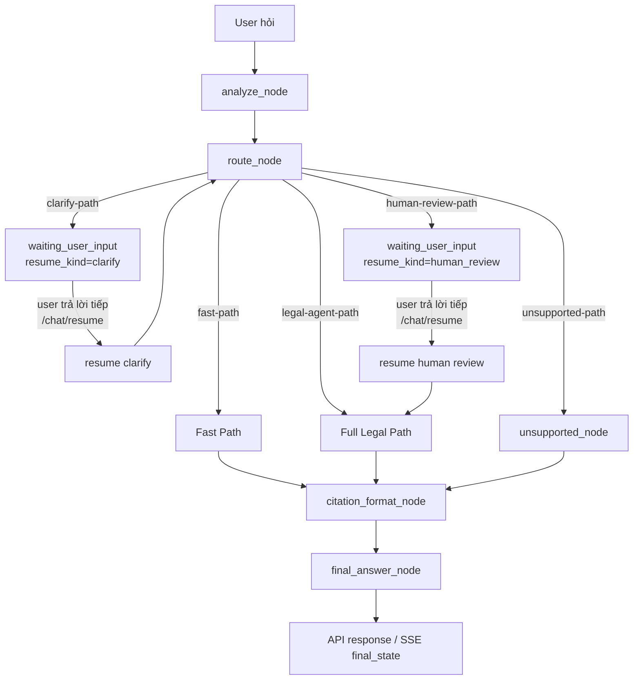
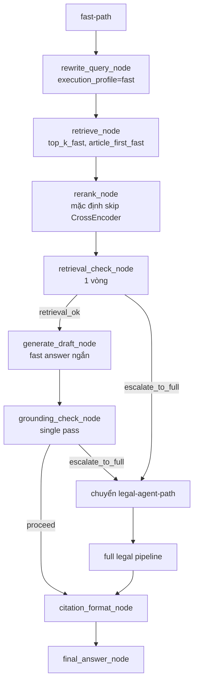
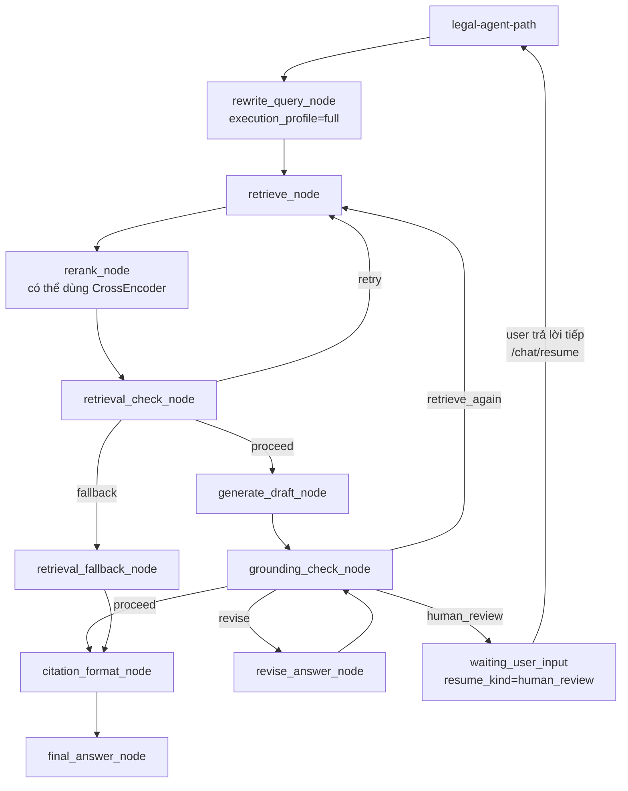
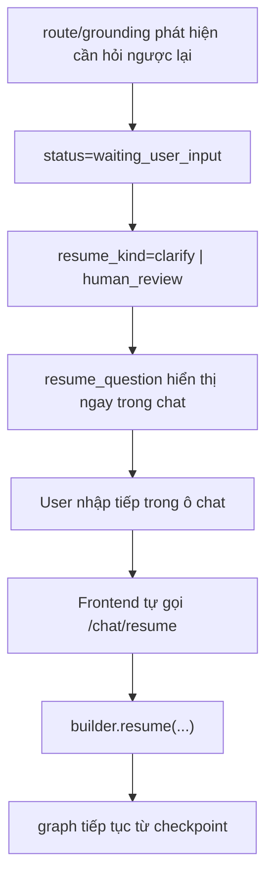

# Hệ thống Hỏi Đáp Văn Bản Pháp Luật Đa Tác Tử dùng RAG và LangGraph

> Báo cáo cập nhật theo kiến trúc hiện tại của hệ thống.  
> Stack chính: **LangGraph + Hybrid Retrieval + Qdrant + FastAPI + Streamlit**.

## 1. Giới thiệu

Dự án xây dựng một hệ thống hỏi đáp văn bản pháp luật tiếng Việt theo kiến trúc agentic mức 3. Hệ thống không chỉ truy xuất tài liệu và sinh câu trả lời, mà còn:

- phân tích câu hỏi để xác định intent và mức rủi ro,
- chọn nhánh xử lý phù hợp giữa `fast-path`, `legal-agent-path`, `clarify-path`, `human-review-path`, `unsupported-path`,
- dùng checkpoint để dừng và tiếp tục hội thoại theo `thread_id` và `session_id`,
- hỗ trợ cơ chế hỏi ngược lại trong chat khi thiếu dữ kiện hoặc cần xác nhận phạm vi trả lời,
- stream event backend theo thời gian thực qua SSE.

Khác với pipeline RAG tuyến tính, phiên bản hiện tại tách rõ:

- **fast-path** cho câu hỏi đơn giản, low-risk, xử lý nhẹ và nhanh,
- **legal-agent-path** cho câu hỏi pháp lý đầy đủ hoặc phức tạp, có retry và revise loop,
- **waiting_user_input** cho các trường hợp cần người dùng trả lời tiếp ngay trong khung chat.

## 2. Mục tiêu hệ thống

- Xây dựng quy trình ingest, chuẩn hóa và lập chỉ mục văn bản pháp luật.
- Tổ chức retrieval theo Hybrid Search giữa BM25 và vector search.
- Điều phối toàn bộ hệ thống bằng `LangGraph` với `AgentState` dùng chung.
- Tách execution policy giữa fast-path và full legal path để giảm độ trễ.
- Hỗ trợ `interrupt/resume` qua `checkpoint` cho clarify và human-in-the-loop.
- Cung cấp backend `FastAPI` và frontend `Streamlit` để chạy hội thoại thực tế.

## 3. Kiến trúc agentic hiện tại

### 3.1 Thành phần chính

- **TV1 - Data**: ingest, parse, chunk văn bản pháp luật.
- **TV2 - Index**: embedding, Qdrant index, collection lifecycle.
- **TV3 - Retrieval**: rewrite query, retrieve, rerank, retrieval check, fallback policy.
- **TV4 - Router**: intent classification, risk tagging, clarify detection, route decision.
- **TV5 - Reasoning**: generate draft, grounding check, revise answer, citation critic.
- **TV6 - Orchestration**: LangGraph builder, subgraph, checkpointing, FastAPI, streaming, resume.

### 3.2 Luồng tổng quát của hệ thống



Luồng hiện tại có 5 nhánh ở `route_node`:

- `clarify-path`: thiếu dữ kiện quan trọng, cần hỏi ngược lại.
- `human-review-path`: câu hỏi rủi ro cao, cần xác nhận phạm vi trả lời.
- `unsupported-path`: ngoài phạm vi pháp luật mà hệ thống hỗ trợ.
- `fast-path`: câu hỏi trực tiếp, low-risk, có thể trả lời nhanh.
- `legal-agent-path`: pipeline đầy đủ cho câu hỏi pháp lý bình thường hoặc phức tạp.

### 3.3 So sánh execution policy giữa fast-path và legal-agent-path

| Tiêu chí | Fast-path | Legal-agent-path |
|---|---|---|
| Mục tiêu | Trả lời nhanh câu hỏi đơn giản | Xử lý đầy đủ câu hỏi pháp lý phức tạp hoặc thông thường |
| Route đầu vào | Low-risk, intent rõ, hỏi định nghĩa/điều luật trực tiếp | Câu hỏi cần reasoning đầy đủ hoặc evidence chưa chắc |
| Rewrite query | Tối đa 2 query, gần câu gốc | Multi-query đầy đủ hơn |
| Retrieve | `top_k_fast` nhỏ, article-first | Top-k lớn hơn, recall cao hơn |
| Rerank | Mặc định bỏ CrossEncoder | Có thể dùng CrossEncoder đầy đủ |
| Retrieval loop | Không loop dài, yếu thì escalate | Có retry retrieval |
| Grounding | 1 lần check | Có revise / retrieve_again / human review |
| Sources | 1-2 nguồn mạnh nhất | Nhiều nguồn hơn nếu cần |
| Human review | Không ưu tiên dùng | Có thể kích hoạt khi risk cao hoặc grounding kém |

## 4. Luồng chi tiết theo nhánh

### 4.1 Fast-path



Đặc điểm của fast-path hiện tại:

- `execution_profile = "fast"` và `fast_path_enabled = true` được gắn từ `route_node`.
- Rewrite query giới hạn tối đa 2 truy vấn.
- Retrieval dùng cấu hình nhỏ hơn để ưu tiên precision thay vì recall.
- Rerank mặc định sắp xếp theo `combined_score`, không dùng CrossEncoder ở cấu hình mặc định.
- Grounding chỉ chạy 1 lần.
- Nếu evidence yếu hoặc grounding không đạt, hệ thống **không loop dài** mà chuyển sang `legal-agent-path`.
- Sau khi hoàn tất, số nguồn hiển thị được giới hạn gọn hơn.

### 4.2 Legal-agent-path



Đặc điểm của legal-agent-path hiện tại:

- Chạy `execution_profile = "full"`.
- Cho phép retrieval loop nếu evidence còn yếu.
- Có thể revise lại câu trả lời nếu grounding chưa đạt.
- Có thể chuyển sang `human review` nếu câu hỏi rủi ro cao hoặc cần xác nhận thêm.
- Phù hợp với câu hỏi pháp lý thực tế, nhiều điều kiện hoặc có tác động đến quyết định pháp lý.

### 4.3 Clarify và human-in-the-loop trong chat



Hệ thống hiện dùng một schema thống nhất cho cả clarify và human review:

```json
{
  "status": "waiting_user_input",
  "resume_kind": "clarify | human_review",
  "resume_question": "<câu assistant hỏi ngược lại>",
  "thread_id": "thread-...",
  "session_id": "session-..."
}
```

Ý nghĩa:

- **Clarify**: thiếu dữ kiện để truy xuất hoặc trả lời chính xác.
- **Human review**: không phải thiếu dữ kiện, mà là cần xác nhận phạm vi trả lời ở câu hỏi rủi ro cao.

Ví dụ:

**Clarify**

```json
{
  "status": "waiting_user_input",
  "resume_kind": "clarify",
  "resume_question": "Bạn muốn hỏi về hành vi vi phạm nào cụ thể?",
  "thread_id": "thread-001",
  "session_id": "session-001"
}
```

**Human review**

```json
{
  "status": "waiting_user_input",
  "resume_kind": "human_review",
  "resume_question": "Câu hỏi này có thể ảnh hưởng đến quyết định pháp lý thực tế. Bạn muốn hệ thống chỉ phân tích căn cứ pháp luật chung, hay tiếp tục theo tình huống cụ thể của bạn?",
  "thread_id": "thread-002",
  "session_id": "session-002"
}
```

## 5. Logic route hiện tại

`route_node` hiện quyết định theo thứ tự ưu tiên sau:

1. Nếu câu hỏi thiếu dữ kiện quan trọng như `hành_vi_vi_pham`, `loai_tranh_chap`, `van_ban_phap_luat`, `tham_chieu_dieu_luat`, `chu_the` thì đi `clarify-path`.
2. Nếu câu hỏi ngoài phạm vi pháp luật hỗ trợ thì đi `unsupported-path`.
3. Nếu câu hỏi có rủi ro cao thì đi `human-review-path`.
4. Nếu câu hỏi trực tiếp, low-risk, intent rõ thì đi `fast-path`.
5. Các trường hợp còn lại đi `legal-agent-path`.

Ví dụ:

- `"Mức phạt là bao nhiêu?"` → `clarify-path`
- `"Theo Luật Thanh niên, thanh niên là gì?"` → `fast-path`
- `"Tôi có nên khởi kiện tranh chấp đất đai với hàng xóm không?"` → `human-review-path`

## 6. AgentState và dữ liệu điều phối

### 6.1 Các field chính trong AgentState

```python
class AgentState(TypedDict, total=False):
    question: str
    normalized_question: str
    intent: str
    intent_score: float
    risk_level: str
    rewritten_queries: list[str]
    retrieved_docs: list[dict[str, Any]]
    reranked_docs: list[dict[str, Any]]
    context: str
    sources: list[str]
    draft_answer: str
    final_answer: str
    retrieval_ok: bool
    grounding_ok: bool
    need_clarify: bool
    unsupported_query: bool
    human_review_required: bool
    review_note: str
    route_reason: str
    next_route: str
    next_action: str
    loop_count: int
    history: list[dict[str, Any]]
    thread_id: str
    session_id: str
    interrupt_payload: dict[str, Any] | None
    retrieval_debug: dict[str, Any]
    citation_findings: dict[str, Any]
    unsupported_claims: list[str]
    missing_evidence: list[str]
    grounding_score: float
    reasoning_notes: dict[str, Any]
    app_checkpoint_id: str
    clarify_question: str
    clarify_reason: str
    risk_reason: str
    top_intents: list[dict[str, Any]]
    retrieval_failure_reason: str
    response_status: str
    status: str
    draft_citations: list[str]
    draft_confidence: float
    review_response: str
    clarify_response: str
```

### 6.2 Các field điều phối đang dùng trong flow hiện tại

Ngoài `AgentState`, runtime hiện còn dùng thêm các field điều phối ở bước route/resume như:

- `resume_kind`
- `resume_question`
- `missing_slots`
- `execution_profile`
- `fast_path_enabled`

Các field này giúp frontend và graph biết:

- có đang chờ người dùng nhập tiếp hay không,
- câu hỏi ngược lại cần hiển thị là gì,
- đang chạy fast-path hay legal-agent-path.

## 7. API contract hiện tại

### 7.1 `POST /chat`

Trường hợp thành công bình thường:

```json
{
  "status": "ok",
  "final_answer": "...",
  "sources": ["..."],
  "route": "fast-path",
  "risk_level": "low",
  "thread_id": "thread-...",
  "session_id": "session-..."
}
```

Trường hợp chờ người dùng nhập tiếp:

```json
{
  "status": "waiting_user_input",
  "resume_kind": "clarify",
  "resume_question": "Bạn muốn hỏi về hành vi vi phạm nào cụ thể?",
  "route": "clarify-path",
  "risk_level": "medium",
  "thread_id": "thread-...",
  "session_id": "session-..."
}
```

### 7.2 `POST /chat/stream`

SSE hiện stream các event chính:

- `route`
- `retrieval_status`
- `partial_answer`
- `grounding_status`
- `clarify_required`
- `review_required`
- `final_state`

Ví dụ event khi cần người dùng nhập tiếp:

```text
event: review_required
data: {"status":"waiting_user_input","resume_kind":"human_review","resume_question":"...","thread_id":"...","session_id":"..."}
```

### 7.3 `POST /chat/resume`

Frontend gọi API này khi người dùng đang ở trạng thái `waiting_user_input` và gửi tiếp một tin nhắn mới.

Ví dụ clarify:

```json
{
  "thread_id": "thread-001",
  "session_id": "session-001",
  "clarify_response": "Vượt đèn đỏ bằng xe máy"
}
```

Ví dụ human review:

```json
{
  "thread_id": "thread-002",
  "session_id": "session-002",
  "review_response": "Chỉ phân tích căn cứ pháp luật chung trước"
}
```

## 8. Cấu trúc thư mục hiện tại

```text
project_root/
├── README.md
├── requirements.txt
├── configs/
│   ├── app.yaml
│   ├── indexing.yaml
│   ├── prompts.yaml
│   ├── retrieval.yaml
│   └── routing.yaml
├── data/
├── evaluation/
├── notebooks/
├── src/
│   ├── tv1_data/
│   ├── tv2_index/
│   ├── tv3_retrieval/
│   │   ├── rewrite_query_node.py
│   │   ├── retrieve_node.py
│   │   ├── rerank_node.py
│   │   ├── retrieval_check_node.py
│   │   └── fallback_policy.py
│   ├── tv4_router/
│   │   ├── clarify_detector.py
│   │   ├── intent_classifier.py
│   │   ├── risk_tagger.py
│   │   └── route_node.py
│   ├── tv5_reasoning/
│   │   ├── citation_critic.py
│   │   ├── generate_draft_node.py
│   │   ├── grounding_check_node.py
│   │   ├── prompt_library.py
│   │   └── revise_answer_node.py
│   ├── graph/
│   │   ├── builder.py
│   │   ├── checkpointing.py
│   │   ├── human_review_node.py
│   │   ├── state.py
│   │   └── subgraphs.py
│   └── app/
│       ├── api/
│       │   ├── main.py
│       │   └── routes/
│       │       ├── chat.py
│       │       └── stream.py
│       └── ui/
│           └── streamlit_app.py
└── tests/
    ├── test_graph_resume.py
    ├── test_retrieval_flow.py
    └── test_router.py
```

## 9. Cấu hình chính cho fast-path

Một số cấu hình quan trọng hiện được dùng để làm fast-path nhẹ hơn:

```yaml
fast_path_enabled: true
article_first_fast: true
top_k_fast: 3
bm25_top_k_fast: 3
vector_top_k_fast: 3
rerank_top_n_fast: 2
enable_rerank_fast: false
max_fast_retries: 0
fast_grounding_single_pass: true
fast_sources_limit: 2
max_queries_fast: 2
```

Ý nghĩa:

- fast-path ưu tiên độ trễ thấp,
- dùng ít truy vấn hơn,
- dùng ít nguồn hơn,
- không chạy revise loop,
- evidence yếu thì chuyển sang full path thay vì cố tự sửa nhiều vòng.

## 10. Cách chạy hệ thống

### 10.1 Cài dependencies

```powershell
pip install -r requirements.txt
```

### 10.2 Chạy backend FastAPI

```powershell
python -m uvicorn src.app.api.main:app --host 127.0.0.1 --port 8000 --reload
```

### 10.3 Chạy Streamlit UI

```powershell
streamlit run src/app/ui/streamlit_app.py
```

### 10.4 Chạy test chính

```powershell
python -m pytest tests/test_graph_resume.py -v
python -m pytest tests/test_retrieval_flow.py -q
python -m pytest tests/test_router.py -q
```

## 11. Kết quả kiến trúc sau khi cập nhật

Sau khi refactor, hệ thống đã đạt các thay đổi chính sau:

- `fast-path` không còn là nhãn route giả mà là một nhánh xử lý thật sự nhẹ hơn.
- `clarify` và `human review` được thống nhất về schema `waiting_user_input`.
- Frontend hiển thị `resume_question` ngay trong khung chat và tự dùng `/chat/resume` cho tin nhắn tiếp theo.
- Streaming SSE bám đúng event backend và giữ được `event_trace`.
- Checkpoint/resume tiếp tục đúng theo `thread_id` và `session_id`.

## 12. Kết luận

Kiến trúc hiện tại đã chuyển từ một pipeline RAG tuyến tính sang một hệ thống agentic có điều phối rõ ràng, tách execution policy theo mức độ phức tạp của câu hỏi và có cơ chế tương tác hai chiều với người dùng trong hội thoại. Đây là điểm khác biệt quan trọng của phiên bản hiện tại so với thiết kế ban đầu.

Các điểm cốt lõi của phiên bản hiện tại là:

- route chính xác hơn giữa `clarify`, `fast-path`, `full legal path` và `human review`,
- execution policy của fast-path nhẹ hơn thật sự,
- hỗ trợ `waiting_user_input` ngay trong chat,
- giữ được resume theo checkpoint,
- phù hợp để mở rộng tiếp cho đánh giá, logging và triển khai thực tế.
